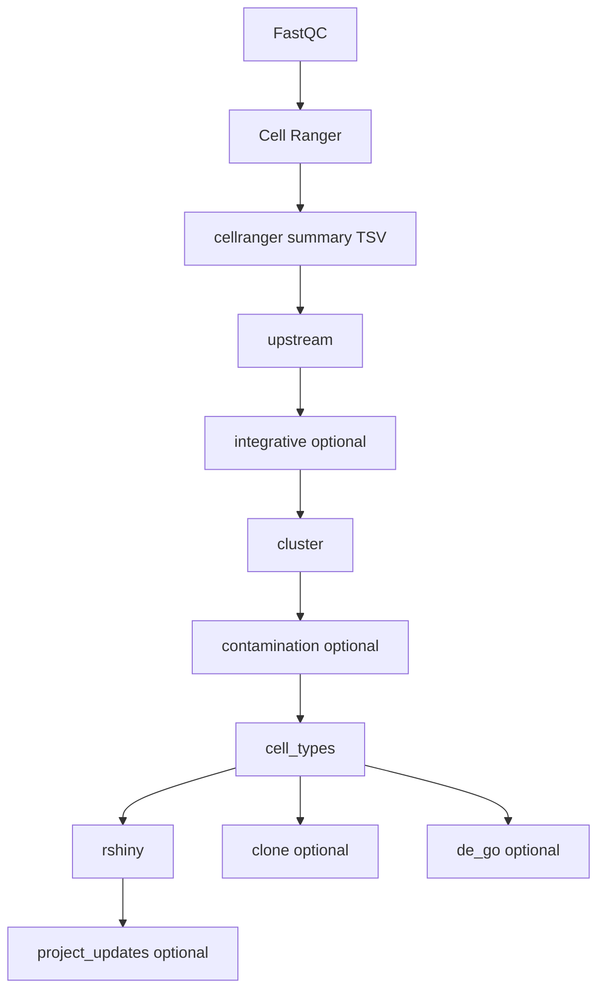

# Pipeline module dependencies (Sprocket WDL)

Sprocket enforces these edges via WDL `after` clauses in
`daedalus_from_cellranger.wdl`. Each arrow on the **spine** means the next
module starts only after the previous one **finishes successfully**.

**FastQC** and **Cell Ranger** are outside this workflow. The WDL starts from
existing Cell Ranger outputs, then builds the summary TSV used for resource
estimation.

## Full pipeline graph

**Spine (sequential):**  
`summary → upstream → integrative (opt) → cluster → contamination (opt) → cell_types → rshiny → project_updates (opt)`

**Parallel (optional, after `cell_types` only):** `clone_phylogeny`, `de_go` — no
downstream module waits on them. They may run at the same time as `rshiny` when
all are enabled.

## WDL `after` targets

| Module | Waits for |
|--------|-----------|
| upstream | write_cellranger_summary |
| integrative | upstream |
| cluster | upstream, integrative (skipped integrative does not block) |
| contamination removal | cluster |
| cell_types | cluster, contamination removal (skipped contamination does not block) |
| rshiny | cell_types |
| clone phylogeny | cell_types |
| de_go | cell_types |
| project_updates | spine through rshiny (upstream … cell_types, rshiny); not clone/de_go |

Optional toggles (`workflow_profile.run_*`) control which nodes run. Skipped
modules do not submit LSF jobs; WDL treats skipped `after` targets as satisfied.
If a skipped spine step produced files the next step needs, those files must
already exist from a prior run.
